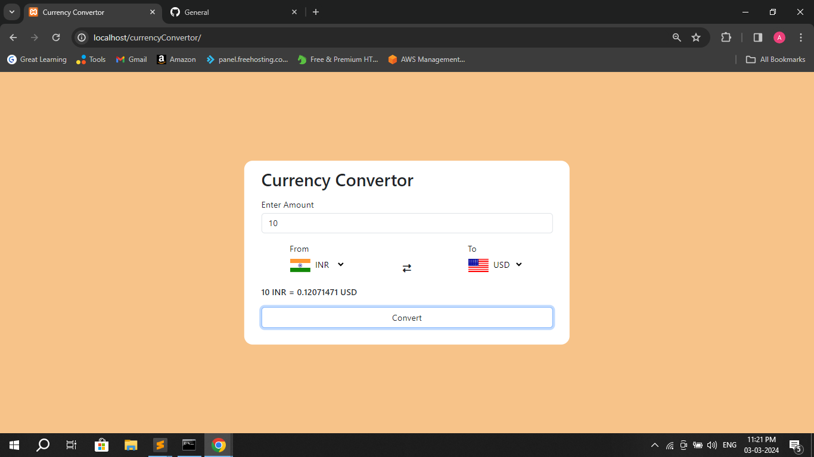

# currencyConvertor
This is a currency converter web application built with HTML, CSS, and JavaScript. It allows users to quickly convert currency values between different countries. The user-friendly interface includes dropdown menus for selecting the source and target currencies, real-time flag updates based on the selected countries, and a conversion button to calculate and display the exchange rate.

Key Features:

Select source and target currencies from dropdown menus.
Real-time flag updates for selected countries.
Convert button triggers dynamic exchange rate calculation.
Responsive design for a seamless experience on various devices.
Technologies Used:

HTML
CSS
JavaScript

How to Use:

Open the web application in a browser.
Choose the source and target currencies from the dropdown menus.
The flags will update based on the selected countries.
Enter the amount to be converted.
Click the "Convert" button to see the calculated exchange rate.

Feel free to contribute, provide feedback, or customize the code for your needs!
